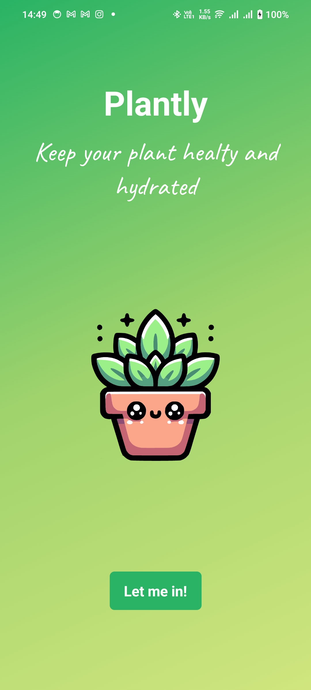
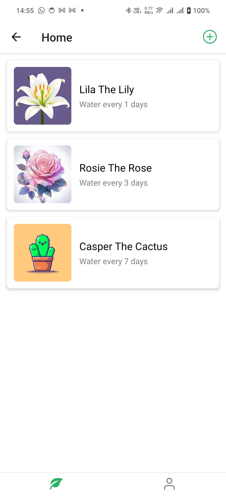
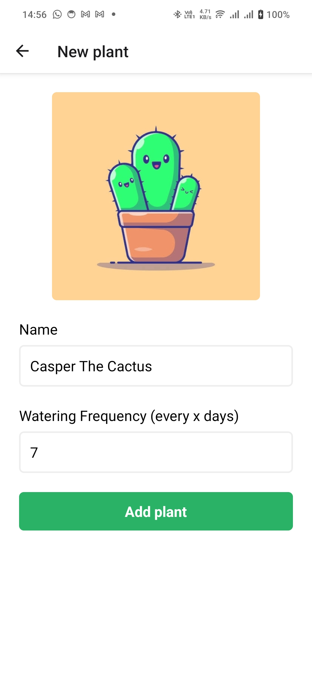
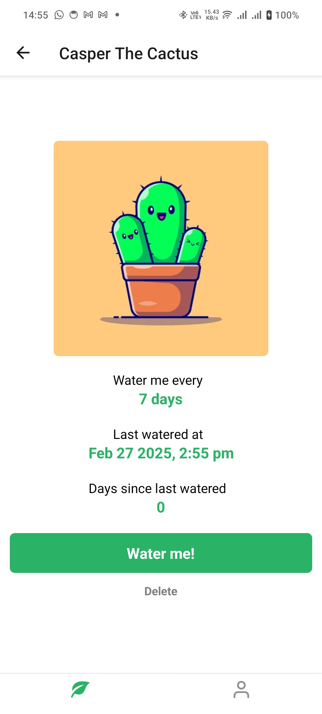

# Plantly

🌱 Plantly is a simple React Native app built with Expo Router, designed to help plant enthusiasts set reminders to water their plants efficiently.

## 📸 Screenshots

Here are some screenshots of the app:

<div style="display: flex; gap: 10px;">
  
  
  
  
</div>

## 🚀 Features

- ⏰ Set reminders to water your plants
- 🏷️ View plant details
- 🌎 Built with Expo Router for seamless navigation

## 🛠️ Tech Stack

- React Native – Core framework
- Expo Router – Navigation system
- Expo – Development and build tool

## 📦 Installation

Clone the repository:

```bash
git clone https://github.com/yourusername/plantly.git
cd plantly
```

Install dependencies:

```bash
npm install
```

Start the development server:

```bash
npx expo start
```

## 📥 Download

Get the app on your device:

- **📱 Android (APK)**: [Download APK](https://appho.st/d/Fz3mLsBa)
- **🍏 iOS (Expo Go)**: [Open in Expo](https://expo.dev/accounts/huseinhk/projects/plantly/builds/86a27d8b-d54e-4c6d-87da-c043e6baa9e3)

> **Note:** iOS users need to install [Expo Go](https://expo.dev/client) to run the app.

🏗️ Contributing

Feel free to fork and contribute! Submit a pull request if you have any improvements or new features.

📜 License

This project is licensed under the MIT License.
